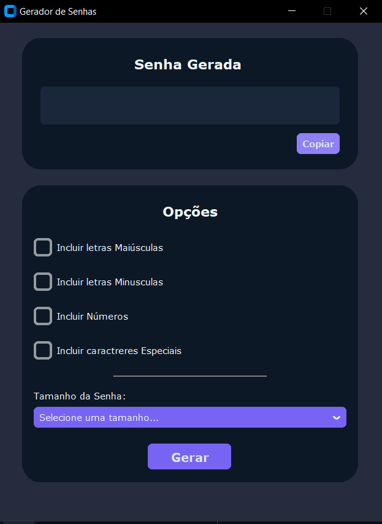

# Password Generator

## 🚀 Getting Started

The software was developed with the main goal of fully utilizing the amazing customTkinter library. With it, it's possible to create modern and sophisticated interfaces.

- Currently, the program allows you to generate passwords up to 40 characters long.
- You can customize your password according to your preferences, including uppercase letters, lowercase letters, special characters, and numbers.
- The functionality to save passwords is not available, only generating new passwords.
- You can copy the generated password directly to the clipboard.



### 📋 Prerequisites

```python
# If you are using Windows, install this version or higher
$ choco install python --version=3.12.2

# If you are on Linux
sudo apt install python3.12 

# If you are on MAC 
brew install python

# Clone this repository
$ git clone 

# Navigate to the password generator project folder
$ cd gerador-senha

pip 
# Install dependencies
$ pip install -r requirements.txt

# After installing the dependencies, run the program
$ python main.py

# Note: Some antivirus software might flag it, just disable it temporarily. 

# Generate the executable
$ pyinstaller --onefile --windowed --name "PasswordGenerator" --icon="img/passwordSec.ico" main.py

# If it fails, run the command to clean the last build
$ pyinstaller --clean --onefile --windowed --name "PasswordGenerator" --icon=img/passwordSec.ico main.py

# In the dist folder, you'll find your .exe file, just run it.

```


### 📌 The software version 2.0 will be released soon, with more amazing features! However, this version will be paid:

- [x] Secure and practical login system
- [x] Storage of multiple passwords for easy access
- [x] Password generation up to 100 characters
- [x] Enhanced design, more modern and intuitive
- [x] Lifetime access, no additional costs
- [] And much more...


